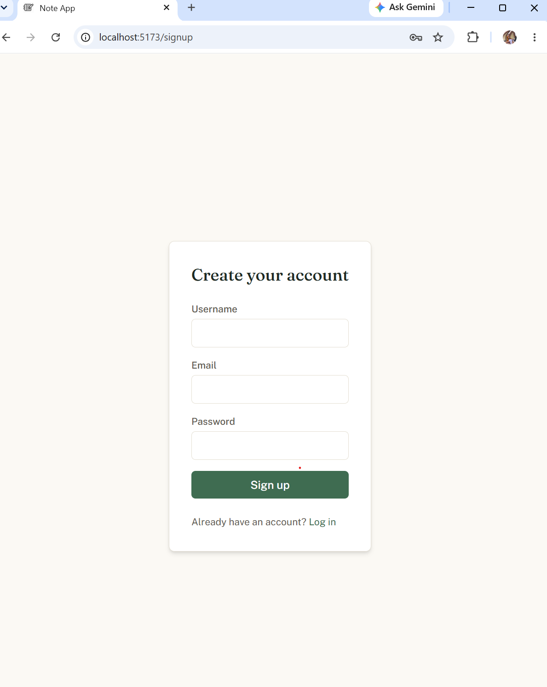
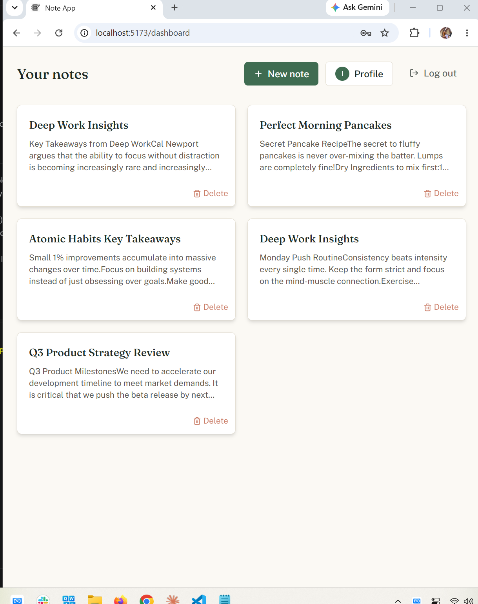
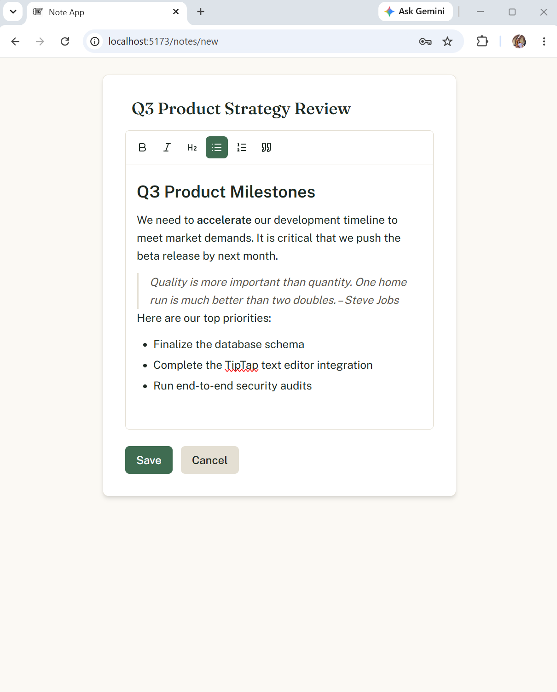

# Notes App

A full-stack notes application built for the 10Pearls MERN internship. Users can sign up, log in, and create, edit, and delete rich-text notes — each user only sees their own.

## Tech Stack

**Backend**

- Node.js, Express 5, TypeScript
- PostgreSQL (via Prisma ORM, Neon-hosted)
- JWT authentication stored in httpOnly cookies
- Pino for structured logging
- Zod for request validation
- Mocha, Chai, Sinon, Supertest for testing

**Frontend**

- React 19, TypeScript, Vite
- Tailwind CSS
- Tiptap for rich text editing
- React Router for navigation
- Jest + React Testing Library for testing

**Code Quality**

- SonarQube for static analysis and test coverage tracking

## Features

- User signup and login with JWT auth (httpOnly cookies, not localStorage)
- User-specific notes — ownership enforced on every note operation
- Create, read, update, and delete notes
- Rich text editing (bold, italic, headings, lists, quotes) via Tiptap
- Dashboard with note grid, empty state, and delete confirmation
- Profile screen with logout
- Global error handling and structured request/error logging
- Responsive layout (desktop, tablet, mobile)

## Screenshots

| Sign Up                                          | Dashboard                                             | Note Editor                                              |
| ------------------------------------------------ | ----------------------------------------------------- | -------------------------------------------------------- |
|  |  |  |

## Project Structure

```
note-app/
├── backend/     Express API, Prisma schema, Mocha/Chai tests
└── frontend/    React app, Jest tests
```

## Getting Started

### Prerequisites

- Node.js (v18+)
- A PostgreSQL database (e.g. a free [Neon](https://neon.tech) instance)

### Backend Setup

```bash
cd backend
npm install
cp .env.example .env
```

Fill in `.env` with your database credentials and a `JWT_SECRET` (any long random string). Then:

```bash
npx prisma migrate dev
npm run dev
```

Backend runs on `http://localhost:7000` by default (configurable via `PORT`).

### Frontend Setup

```bash
cd frontend
npm install
cp .env.example .env
```

Set `VITE_API_URL` in `.env` to your backend's API URL (default: `http://localhost:7000/api`). Then:

```bash
npm run dev
```

Frontend runs on `http://localhost:5173`.

## Testing

**Backend** (Mocha/Chai):

```bash
cd backend
npm test
npm run test:coverage   # generates coverage report for SonarQube
```

**Frontend** (Jest):

```bash
cd frontend
npm test
npm run test:coverage
```

## Code Quality — SonarQube

This project is analyzed with SonarQube. To run analysis locally:

1. Run a local SonarQube server (see [SonarQube docs](https://docs.sonarsource.com/sonarqube-community-build/try-out-sonarqube/))
2. Generate test coverage for both backend and frontend (commands above)
3. From the project root:

```bash
sonar-scanner -Dsonar.token=YOUR_TOKEN
```

Configuration lives in `sonar-project.properties`.

## Notes on Architecture

- Authentication uses httpOnly cookies rather than localStorage, so the JWT is never accessible to frontend JavaScript.
- The backend follows a layered structure: routes → controllers → services → repositories, making each layer independently testable.
- Every note operation verifies the requesting user owns the note before allowing access (returns 403/404 as appropriate).
